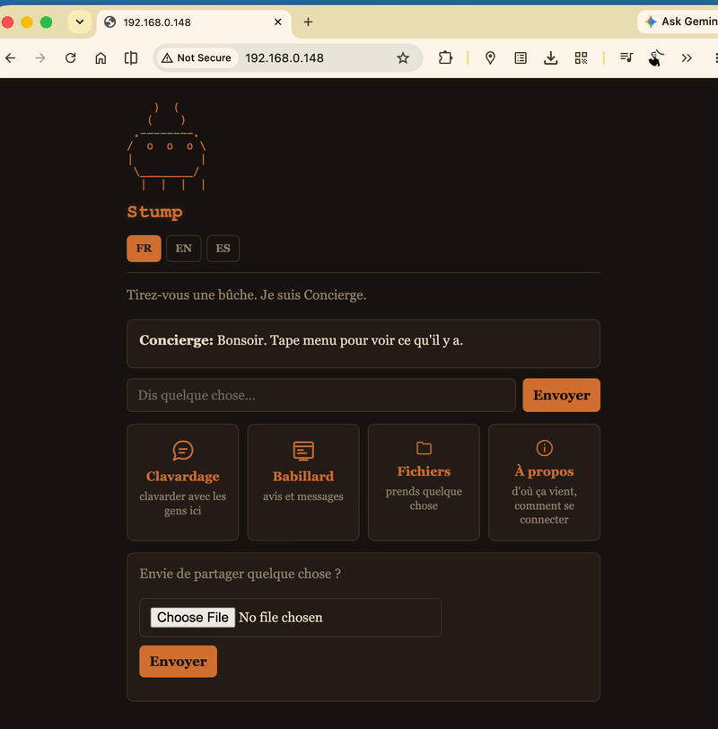

# Project Stump — Beta A (Release)



An off-grid community node. A long-range encrypted mesh radio and a
local high-bandwidth server, deliberately kept on separate hardware.

```
[ Mesh ] <--( LoRa )--> [ Heltec V3 ] <--( WiFi/TCP :7633 )--> [ ESP32-S3-CAM ] <--( WiFi )--> [ Local room ]
                        CONTROL PLANE                          DATA PLANE
                        RNS identity, LXMF,                    SD storage, chat, files,
                        routing. Low power.                    billboard, about page, captive portal.
```

Walk up with a phone, join the WiFi, and get a chat room, a bulletin
board, a file library, and an About page explaining the project — in
French, English, or Spanish. Meanwhile the node holds a cryptographic
identity on the Reticulum mesh, so people reachable only over LoRa can
share rooms with the people standing in front of it.

---

## Before anything else: access modes are in test

This build ships **three** node-wide access profiles — `open`,
`hybrid`, `mandatory` — plus a separate, newer per-room access system
(minted/invite-only rooms) and a mesh-landing-room feature layered on
top of both. All of this is real, implemented, and passes its own test
suite. **None of it has been field-validated at the scale or duration
this release is going out to.**

**Recommendation for this release: leave `AUTH_MODE` at `open`.**
Everything else in this README about `hybrid`, `mandatory`, room tiers,
and the mesh landing room is accurate and instructions are provided —
use them if you're specifically testing that part of the system. But if
you just want a Stump that works the way every walk-up visitor expects
(anyone can read, anyone can chat, nothing asks for a password), `open`
is the tested, unsurprising choice, and it's the default.

One naming trap worth knowing before you touch any of this: **"hybrid"
means two unrelated things** — the global `AUTH_MODE` (a node-wide
security posture) and a per-room *tier* (a property one specific room
can have, regardless of global mode). A real field test already
confused these two. See [Access control](#access-control) below before
assuming you know what "turn on hybrid" does.

---

## Contents

- [Quick start](#quick-start)
- [Reading the boot log](#reading-the-boot-log)
- [Troubleshooting](#troubleshooting)
- [Repository layout](#repository-layout)
- [Architecture](#architecture)
- [Standalone Heltec V3 transport role](#standalone-heltec-v3-transport-role)
- [HTTP API](#http-api)
- [Access control](#access-control)
- [File storage](#file-storage)
- [Billboard](#billboard)
- [Direct messages](#direct-messages)
- [Internationalization](#internationalization)
- [The About page](#the-about-page)
- [Plugins](#plugins)
- [Configuration](#configuration)
- [Conventions for contributors](#conventions-for-contributors)
- [Testing](#testing)
- [Verification status](#verification-status)
- [Credits](#credits)
- [Hidden features](#hidden-features)

---

## Quick start

```bash
python3 provisioner.py
```

Handles both boards: flashing, upload, guided configuration, plugin
setup, and diagnostics.

```bash
python3 provisioner.py --check-tools      # verify esptool/mpremote/rnodeconf
python3 provisioner.py --scan             # list connected boards
python3 provisioner.py --upload-app PORT  # (re-)upload firmware only
python3 provisioner.py --get-ip PORT      # query LAN + hotspot addresses
python3 provisioner.py --diag PORT        # serial, SD, radio, bridge tests
python3 provisioner.py --wipe-sd PORT     # reformat a problem SD card
```

The Heltec needs its WiFi mode set once (the wizard does this too):

```bash
rnodeconf <port> --autoinstall
rnodeconf <port> -w STATION --ssid "..." --psk "..." \
          --ip 192.168.0.222 --nm 255.255.255.0
```

Then join the node's WiFi. By default that's the literal network name
`LaBuche-Stump.web.app` — a real, publicly hosted page explaining what
the network is, so anyone can read it off their phone's WiFi list and
look it up on their own data before ever joining. The Provisioner
wizard also offers a custom name instead, with or without the AP's own
IP appended (see [Configuration](#configuration)).

---

## Reading the boot log

Connect with `mpremote connect <port>` and reset. A healthy boot prints,
in order:

```
Project Stump -- Beta A
[ap] 'LaBuche-Stump.web.app' up on 192.168.4.1 (active=True)
[fserv] SD mounted at /sd
Ed25519/X25519: fast IRAM crypto active
[fservbot] active: prefix '!', 7 trigger(s), notice off
[stumpid] active: mode=open
[plugin] active: fservbot, stumpid
[web] serving on port 80
[dns] captive portal answering on port 53 -> 192.168.4.1
LXMF address: <hash>
Announced as: <NODE_NAME>
```

Every line prints **after** the thing it describes succeeded. If a
line is missing, that component failed — and the failure prints its own
reason.

**The crypto line matters more than it looks.** Three possible outcomes:

- `Ed25519/X25519: fast IRAM crypto active` — healthy, ~17.6ms per
  signature verification.
- `SLOW crypto path active (...)` — a native module loaded, but not the
  fast one. Signing and verifying run roughly **80x slower**. Check that
  `lib/ed25519_iram.mpy` is present and matches this board's firmware
  build.
- `NO native crypto module loaded -- running pure Python` — slower
  again. Something is wrong with the upload or the board.

---

## Troubleshooting

**Board won't flash — "No serial data received".**
Try the other USB-C socket on the Freenove first — only one is wired to
the chip's data lines. If that isn't it, enter the ROM bootloader by
hand: hold BOOT, tap RESET, release BOOT.

**"Files don't match the current known-good version".**
Wrong build folder, not corrupted files. The Provisioner refuses
wrong-version folders outright.

**Site can't be reached / connection refused.**
Nothing is listening on port 80. A persistent startup failure now stops
and reports itself after three attempts rather than looping silently —
check the serial console.

**The LoRa bridge periodically drops and re-sends its full radio
config, and effective range shrinks.**
Diagnosed against a real field report. The node's own mesh
announcement (`REANNOUNCE_INTERVAL`, 120s by default) and any message
forwarded to a mesh peer are both fully synchronous — zero yield points
anywhere in that call chain — so each one freezes the *entire* event
loop, including the bridge's own keepalive, for however long the
signing takes. If that freeze outlasts the Heltec's connection
tolerance (observed empirically around 7 seconds of silence), the
bridge disconnects and reconnects, re-sending the complete radio setup.
Mitigated (not eliminated) by priming the bridge's keepalive immediately
before both known-expensive calls — see `prime_all_bridges()` in
`urns/interfaces/wifi_serial.py`.

**A room I tiered isn't gating anyone.**
`/rooms` annotates every non-open room with its tier in brackets. If a
room shows no tag, it's open.

**Mesh peers aren't landing where I told them to expect.**
Check `/admin <password> meshroom` with no argument — it reports the
current setting. If a mesh peer isn't verified and the landing room is
tiered `minted` or `hybrid`, they're redirected to `#main` instead, with
a system message explaining why. See [Access control](#access-control).

**Images on the About page's hardware gallery are broken.**
They're served from `/sd/about/`, not baked into the firmware — a
technician has to copy the actual photos there. See `/about/img` in
[HTTP API](#http-api).

---

## Repository layout

```
final_firmware/              75 files hashed, 64 uploaded to a CAM (~1.3 MB)
├── main.py                  CAM boot entry -- boots example_node.py via boot_common
├── boot_common.py           Shared retry-vs-give-up boot logic main.py delegates to
├── example_node.py          the real CAM boot sequence; wires everything together
├── config.py                ALL CAM configuration lives here
├── node_common.py           shared identity/router bring-up, safe for other firmware to import
├── i18n.py                  trilingual (FR/EN/ES) string table + per-visitor language state
├── barkeep.py                HTTP server (the only one), chat console, page router
├── rrc.py                    RRC chat engine — rooms, nicks, history, DMs
├── rrc_ui.py                  RRC web client (mIRC-style)
├── rrc_mesh.py                 RRC ↔ LXMF bridge; mesh peers join rooms, land per stumpid's setting
├── billboard.py                 bulletin board storage + rendering
├── fserv.py                      file storage, streaming I/O, credit economy
├── captive_portal.py              AP bring-up + DNS redirect
├── flasher_ui.py                   browser-based board flasher (WebSerial)
├── lora_boards.py                   LoRa pinout presets (native SPI radio boards)
├── fservbot/                         PLUGIN — channel bot
├── stumpid/                           PLUGIN — identity verification + room + mesh access
├── tools_payload/                      host-side flasher assets (not uploaded to the board)
├── lib/                                 native crypto accelerators
├── peripherals/                          ADC / battery reading (incl. gated-divider boards)
└── urns/                                  µReticulum: identity, LXMF, crypto, interfaces

provisioner.py               technician deployment tool (runs on a laptop) -- provisions
                              three board roles; see "Standalone Heltec V3 transport role" below
```

**Not part of `final_firmware/` at all**: the standalone Heltec V3 transport role runs
`microReticulum_Firmware`, a real, pre-built, third-party C++ firmware -- flashed and
configured entirely via `rnodeconf`, with no files from this repository involved. See its
own section below for why, and what replaced an earlier, retired approach.

---

## Architecture

### Boot sequence

1. Join upstream WiFi — optional; failure is non-fatal
2. Bring up the node's own AP (`LaBuche-Stump.web.app` by default)
3. Mount SD; migrate any flash-stored billboard onto it
4. Activate plugins (`load_plugins()`)
5. Start Reticulum + LXMF, register delivery identity
6. Start the HTTP server (port 80) and captive-portal DNS (port 53)
7. Start the mesh bridge; announce, then re-announce every `REANNOUNCE_INTERVAL`

### The single most important structural fact

**This is a cooperative, single-threaded event loop.** Any blocking call
anywhere freezes *everything*. LXMF signing has zero yield points
anywhere in its call chain — confirmed directly — so any send or
announce blocks the whole node for however long that crypto takes. See
[Troubleshooting](#troubleshooting) for the field-diagnosed consequence.

### One server, many modules

**`barkeep.py` owns port 80. Nothing else binds a TCP port.**
`billboard.py`, `fserv.py`, `rrc.py` are pure logic, called directly by
barkeep's router.

### Room traffic is radio traffic

Since `rrc_mesh` forwards room messages to subscribed mesh peers,
**anything posted to a room costs LoRa airtime**. Both the per-room
tier system and the mesh landing room exist partly to keep an anonymous
walk-up visitor's chatter from consuming a mesh peer's airtime budget
by default.

### Import graph (no cycles)

```
example_node → captive_portal, barkeep, fserv, billboard, rrc_mesh, node_common, config
barkeep      → billboard, fserv, rrc, rrc_ui, flasher_ui, i18n
rrc_mesh     → rrc, stumpid.core (soft -- see below)
stumpid.core → rrc, i18n
rrc_ui       → rrc, i18n
billboard    → i18n            (for _extract_ip; must NOT import fserv -- would close a cycle)
```

`rrc_mesh`'s import of `stumpid.core` is wrapped in `try/except
ImportError` — the mesh bridge has no hard dependency on the identity
plugin being installed at all. If `stumpid` isn't present, mesh peers
land in `#main`, exactly as if no landing-room setting had ever been
configured.

---

## Standalone Heltec V3 transport role

A single, battery-powered Heltec V3 — no CAM, no attached host, no
HTTP/chat stack — acting as a real, standalone Reticulum transport
node: it rebroadcasts announces and forwards in-transit packets for
other nodes, extending mesh reach.

**This runs `microReticulum_Firmware`** (github.com/attermann/microReticulum_Firmware),
a real, actively maintained fork of RNode_Firmware with a C++ port of
the Reticulum stack built in — a pre-built, third-party binary, not
any file from this repository. Flashed and configured entirely
through `rnodeconf`, the same tool the "Control Plane" Heltec role
already uses.

**Confirmed working in the field** on this exact board.

### Why this, and not a custom MicroPython app

An earlier version of this role ran a hand-written MicroPython
application (identity + `urns` + a custom LoRa interface) built
specifically for this project. It hit a real, reproducible
`MemoryError` on actual (PSRAM-less) hardware, traced to native crypto
module loading during identity generation, and never got past it —
despite a 70% code-size reduction from pre-compiling to `.mpy`
bytecode and reordering initialization to give the radio first claim
on available heap. `microReticulum_Firmware`, designed from the start
around exactly this board's memory constraints, worked immediately.
That custom application, its config file, and its LED/display
peripherals have been removed from this repository entirely — nothing
from the old approach is still in use.

### Provisioning it

`python3 provisioner.py` offers this as a third board role. The
sequence, run by `flash_heltec_standalone_reticulum()`:

1. **`rnodeconf --clear-cache`** — so a stale, previously-cached build
   is never silently reused instead of the current release.
2. **`rnodeconf --autoinstall --fw-url <microReticulum_Firmware releases URL> <port>`**
   — interactive; rnodeconf asks its own hardware questions.
3. **`rnodeconf <port> -T --freq ... --bw ... --txp ... --sf ... --cr ...`**
   — TNC mode and every radio parameter locked together in **one**
   command, not set separately. Setting these as separate steps risks
   rnodeconf dropping the write cycle or reverting to Normal
   (host-controlled) mode instead of TNC. The wizard prompts for and
   confirms these against the same `DEFAULT_RADIO` values the existing
   Heltec role already uses.

Switching to `-T` makes the board write to EEPROM and immediately
reboot standalone, which drops the serial connection mid-command —
that shows up as a timeout or non-zero exit from `rnodeconf`'s own
perspective. **This is expected**, not a failure; the code treats it
as such and waits before the final verification step, which runs
`rnodeconf --info` and checks the output for `TNC` directly, rather
than trusting the lock command's own unreliable-by-design exit status.

**The one thing no amount of testing from here can close**: radio
parameters have to match whatever your actual deployed Heltec Bridge
units were provisioned with — an operational fact set at flash time on
each existing unit, invisible from source. Confirm this before relying
on a newly-provisioned relay in the field.

### Known limits specific to this role

- `--upload-app` (the CLI shortcut for re-pushing MicroPython files
  without reflashing) doesn't apply here — there are no files to
  upload; the firmware is a single pre-built binary.
- `--diag` now treats this role the same as the existing "heltec"
  RNode role: serial-bridge and SD-card checks correctly skip (neither
  applies — no MicroPython, no SD card), and the radio check
  (`rnodeconf --info`) runs for real, since this role now genuinely is
  RNode-family firmware.

---

## HTTP API

| Method | Path | Purpose |
|---|---|---|
| GET | `/` | BarKeep console (also the captive-portal landing page) |
| POST | `/chat` | Send a BarKeep command; body is raw text |
| GET | `/billboard` | Bulletin board page |
| POST | `/post` | Add a notice; body `entry=<urlencoded>` |
| GET | `/rrc` | RRC chat client |
| GET | `/rrc/poll?room=&since=` | New room messages, private messages, and who's currently in the room (JSON) |
| POST | `/rrc/send` | Send a chat line or `/command`; body is raw text |
| POST | `/upload` | Upload a file; `X-Filename` header, raw body. `507` if the card is over its capacity ceiling even after evicting the oldest shared files (see "File storage" below) |
| GET | `/download?f=` | Download a file (streamed, with real filename) |
| GET | `/files` | Browsable file listing (no admin UI on this page — see "Access control" #4) |
| GET | `/admin` | Password-only login; no link anywhere points here on purpose |
| POST | `/admin` | Validates the password, shows a checkbox file list on success |
| POST | `/admin/delete` | Batch-deletes checked files after re-validating the password for real |
| GET | `/about` | About page — what Stump/Fireflies are, how to connect, hardware gallery |
| GET | `/about/img?f=` | Serves a gallery image from `/sd/about/`, inline (no download prompt) |
| GET | `/tools` | Technician tools page — downloads only, no CLI instructions shown here (see below) |
| GET | `/tool?f=` | Download a tool file |
| GET | `/flash` | Browser-based board flasher (WebSerial) — still live, no longer linked from `/tools` |
| GET | `/fw?f=` | Firmware image / catalog for the flasher |
| GET | `/lang?set=&next=` | Sets the requesting visitor's language, redirects back |

Any unmatched path returns the BarKeep page with `200` — captive-portal
detection depends on probe requests getting a real HTTP response.

### What ends up in `/sd/tools/`, and why

`provisioner.py`'s `install_tools_on_node()` pushes a few things onto
the node's own SD card during provisioning, so a technician can walk
up with nothing but a laptop and pull down what they need over HTTP
instead of carrying a USB stick:

- **`provisioner.py` itself** — the node hands back the exact version
  it was provisioned with, so there's never doubt about whether a copy
  pulled off the node matches what's actually running.
- **`README.md`** — same reasoning, right next to it: the setup steps a
  technician needs (`--check-tools`, the standalone Heltec transport
  commands, everything else in this document) live in this file now,
  pushed to the node instead of being duplicated as a shorter,
  separately-maintained CLI snippet that used to sit directly on the
  `/tools` page — one real source for those commands instead of two
  that could quietly drift apart.
- **`LICENSE`** — the MIT license this build ships under, so a copy
  pulled off the node carries its actual terms with it, not just the
  code. Named `LICENSE` with no extension deliberately, matching the
  standard convention GitHub, package managers, and license scanners
  all look for by that exact name.
- **`Stump_Beta_A.zip`** — the full firmware source, built *fresh* from
  the technician's own `final_firmware/` directory at push time rather
  than copied from wherever their original download happened to land.
  Built this way specifically so it can't go stale relative to what's
  actually provisioned, and doesn't depend on the technician having
  kept the original zip around after extracting it.
- **The browser flasher's own assets** (`esptool-bundle.js`, its
  licence, `catalog.json`, and any staged firmware images) — see
  "Hidden features" at the end of this document for why this exists
  but isn't linked from `/tools` anymore. Confirmed directly: this
  folder holds no actual firmware images today, only a `README.txt`
  with instructions for staging one. Worth knowing before ever
  following those instructions for real: `catalog.json`'s own
  `rnode-heltec-v3` entry names its source as the GPL-3.0-licensed
  RNode Firmware CE releases. A `.bin` obtained that way and staged
  here would make this node *convey* that GPL-3.0 object code over
  `/fw?f=` and `/tool?f=` to anyone who downloads it — which is a
  different thing from flashing it directly from a laptop, and GPL-3.0
  §6 requires that conveyance be accompanied by the corresponding
  source, or a written offer for it. Neither this document nor the
  `LICENSE` pushed alongside it provides that; see the warning in
  `tools_payload/images/README.txt` for what staging a real binary
  there would actually require.

All of it downloads from `/tools` via `/tool?f=`, streamed in 16KB
chunks like every other file transfer in this project — confirmed
directly for `Stump_Beta_A.zip` specifically, since at roughly 440KB
it's by far the largest thing served from that route: hashed the
actual streamed bytes against the source file's hash rather than just
checking the response arrived, and confirmed the transfer happens in
dozens of real chunks, never one large in-memory write.

Best-effort like the rest of provisioning: a node with no SD card, or
a technician's copy of `final_firmware/` gone missing, still finishes
provisioning normally, it just can't hand these back.

---

## Access control

Two genuinely separate systems. Read this section before touching
either, since conflating them is exactly what confused a real field
test.

### 1. Global `AUTH_MODE` — a node-wide security posture

Set at provisioning time, or live via `/admin <password> mode <m>`:

- **`open`** (default, recommended for this release) — nothing is
  gated. Anyone can read, post, join, DM.
- **`hybrid`** — reading stays open; writing anything (posting,
  joining, DMing, `/topic` with an argument) requires a verified
  identity (`/auth`). A **plain message is always classified as a
  write**, unconditionally — a mesh peer's very first message will be
  challenged before a room's own tier ever gets consulted.
- **`mandatory`** — everything except `/auth`, `/whoami`, `/help`
  requires verification.

**Status: implemented, unit-tested, not field-hardened.** Use `hybrid`
or `mandatory` if you're specifically testing identity verification;
otherwise stay on `open`.

### 2. Per-room tiers — a property of one specific room

Independent of global mode, and it stays in effect **regardless of
which global mode is active** — a tiered room's own gate runs
unconditionally, even under global `open`, on purpose. Tiers:

- **open** (the default for any room that's never been touched)
- **minted** — only a verified identity may join. No exceptions.
- **hybrid** *(the other "hybrid" — see the warning at the top of this
  README)* — a verified identity joins freely; anyone else needs an
  invite from someone verified who is **already in that room**.

```
/admin <password> room <name> <open|minted|hybrid>   -- create or re-tier a room
/invite <nick>                                        -- invite someone into the room you're in
```

`/rooms` shows each non-open room's tier in brackets:
```
#main  (3 here)  -- General. Be decent.
#lounge  (2 here)  [hybrid]
```

**Status: implemented, tested against every combination with the
global mode above, not field-hardened.**

### 3. The mesh landing room

Where a mesh peer lands **automatically**, on first contact — not
something they request, since they never typed `/join` at all.

```
/admin <password> meshroom <name>   -- mesh peers now default here instead of #main
/admin <password> meshroom off      -- back to today's behaviour (#main)
/admin <password> meshroom          -- shows the current setting
```

Unset by default — nothing changes for a deployment that never touches
this. Runtime-only, like a live `mode` change: it reverts on reboot,
not written to `config.py`.

**Automatic placement is gated exactly like an explicit `/join` would
be**, on purpose. If the landing room is tiered and an unverified peer's
first message arrives, they're redirected to `#main` instead, with a
system message explaining why, translated into whatever language
they're set to (see [Internationalization](#internationalization)) —
mesh peers get the same courtesy a rejected web visitor already gets.
This holds identically under all three global modes: the redirect
doesn't get stricter or looser depending on `AUTH_MODE`, because the
room-tier gate this relies on was already mode-independent before the
mesh landing room existed.

**Status: implemented and tested across all three global modes in the
same test run, not yet exercised against a real mesh peer on real
hardware.**

### 4. The `/admin` page — file deletion, billboard moderation, and site customization

A separate, narrower gate from the three above — not tied to
`AUTH_MODE` or room tiers at all, and not part of `/files` anymore
either. There is no admin UI, drawer, or delete link visible on any
page a normal visitor sees. Everything in this section lives entirely
at `GET /admin` — an address with no link pointing to it from anywhere
in the visible UI, reachable only by typing it directly.

**Deleting files.** `GET /admin` shows a password field only. A
correct password shows every current file as a checkbox, with the
password carried forward as a hidden field. Checking several files and
submitting once deletes all of them together — `POST /admin/delete`
re-validates the password for real rather than trusting the hidden
field just because it arrived with the form, since anyone could POST
there directly with a forged one.

The password check reuses `stumpid.core.check_admin_password()`
directly — the same function `/admin <password> ...` chat commands
already use for mode/room-tier/meshroom, not a second, competing
mechanism. It tries stumpid's own `AUTH_ADMIN_PASSWORD` first, falls
back to fservbot's operator password (read live, not duplicated), and
refuses outright — `403`, nothing touched — if neither plugin is
installed at all.

An earlier version of this put a collapsed drawer directly on `/files`
— a dropdown, password field, and button all on one row, which
overflowed its own container on narrower viewports, and needed a full
password re-entry per file with nothing to select more than one at a
time. Both problems came from the same root cause: admin controls
living on a page every visitor already sees. Moving it to its own
unlinked page removed both at once, not just the layout.

**Deleting billboard posts.** Added on request, for removing something
inappropriate without waiting up to 72 hours for the Billboard
section's own auto-purge to age it out. The same login shows every
current post as a checkbox (newest first) with enough of its text to
identify it; `POST /admin/delete_post` re-validates the password the
same strict way `/admin/delete` does, and calls
`billboard.delete_entry()` for each one checked.

Each post is identified by its own timestamp rather than a separate ID
field added just for this — confirmed directly that MicroPython's
`str(float(x))` round-trips exactly for real timestamps here, so
comparing as strings (never re-parsing to float) sidesteps any
formatting mismatch risk. `/admin/delete_post` had to be placed
*before* the existing `/admin/delete` check in the router, not after —
`"/admin/delete_post".startswith("/admin/delete")` is `True`, so a
router matching by prefix means the more specific path always has to
come first, or the broader, older check catches it instead and tries
to delete files named after timestamps that don't exist.

A real, reported bug found after this shipped: a post made *before*
the auto-purge feature existed, and never touched by a prune pass
since (a board's first admin visit after upgrading, before anyone had
posted again to trigger one), reads back from `_read_entries()` with
no timestamp at all — its stored line genuinely has only two fields,
never three. That rendered as a checkbox with `value='None'`, and
deleting it always silently failed: `delete_entry()` can only match a
stored line that actually has three fields including a real
timestamp, and a never-pruned old entry doesn't have one to match
against. The delete request would succeed, report "0 message(s)
deleted", and leave the post sitting there — the exact same *symptom*
as the double-encoding bug that hit file deletion earlier, but a
different cause underneath. Fixed by having the admin page trigger a
prune pass (with no new post to add) before it ever reads the entries
to build checkboxes from — every post gets a real, stored timestamp
stamped onto it before the admin ever sees a checkbox, so what's
displayed and what's on disk can never disagree. Confirmed directly by
reproducing the exact old-format, never-pruned scenario end to end
(the entry used to be genuinely undeletable; it now deletes correctly)
and re-confirming the already-working, already-timestamped case is
completely unaffected.

That same fix immediately introduced a second, more serious bug of its
own, also real and reported: selecting one post and deleting it
emptied the *entire* board. `_prune_and_write()` computes `now` once
per call and, before this, reused that exact value verbatim for every
untimestamped entry it stamped in that same call — so several old
posts landed on the *identical* timestamp instead of merely close
ones. `delete_entry()` identifies a post by timestamp alone, with no
separate ID field (see its own docstring for that reasoning), so
"delete the post at this timestamp" matched and removed every post
sharing it — one checkbox, whole board gone. Confirmed directly by
reproducing it exactly: three distinct old posts, one admin page load,
all three landing on one shared value, one checkbox deleting all
three.

Fixed in two layers, not one. First, the actual cause: each
untimestamped entry stamped within the same `_prune_and_write()` call
now gets a distinct, microsecond-scale offset from `now` rather than
the bare, shared value — unique for identification purposes while
staying "now" for everything that reads it (the 72-hour TTL check,
display order). Second, independent of that fix and kept regardless:
`delete_entry()` now only ever removes the *first* line it finds
matching a given timestamp, never every line that matches — the
original code had no such limit, which is what let one match turn into
three removals. If some other, not-yet-anticipated cause ever produces
a collision again, one checkbox can now only ever remove one post,
never silently take out everything sharing its identifier with it.
Confirmed directly both ways: the exact reported scenario now deletes
exactly one and leaves the other two, and a timestamp collision forced
directly (bypassing the fixed stamping logic entirely, standing in for
any future cause this hasn't anticipated either) still only ever
removes one of the two colliding posts, never both.

Checked whether the file-deletion flow above shares the same flaw,
since both now identify what to delete from a value carried in a
checkbox. It doesn't, structurally: a file is deleted by
`os.remove(SHARED_DIR + "/" + filename)` — the filesystem itself
guarantees two files can never share a name in the same directory, so
there is no "computed value that can collide" step for files the way
a timestamp is computed and can coincide for posts. Each checked
filename maps to exactly one real, distinct path; there is nothing
equivalent to fix there. Re-ran the full existing file-deletion test
suite alongside this fix to confirm that conclusion holds against the
real code, not just the reasoning above — no changes needed, and none
made.

**Theme and logo.** The same login also unlocks four theme presets
(Default/Amber, Phosphor, OLED, Paper — CSS custom properties switched
via a `[data-theme]` attribute), a five-color custom palette
(background, panel, text, accent, border), and an SVG logo the default
stump-cross-section mark can be replaced with, hidden, or restored.
One login, not a second password prompt, since both are "things only
an admin should touch."

**Worth being precise about, because it's easy to assume otherwise for
a "branding" feature: all of this is `localStorage`, not server-side.**
Setting a theme or uploading a logo through `/admin` changes what *that
one browser* sees on its own next visit — not what every other visitor
sees. There is currently no way to make a theme or logo choice apply
site-wide to everyone; that would mean writing the choice to the SD
card and having every page read it back, which this deliberately
doesn't do. If site-wide branding for every visitor is actually the
goal here rather than a per-admin preference, that's a different,
larger feature than what's built.

An admin visiting `/admin` sees their own current custom colors and
saved SVG pre-filled in the controls (read back from their own
`localStorage`), not because the server remembers anything.

An earlier version of this section's client-side JavaScript had a real
bug worth noting since it's the kind that's easy to reintroduce:
placeholder tokens for translated header text were substituted into
positions still wrapped in the template's own leftover quote marks.
French specifically broke the entire RRC chat page's script — not just
the mistranslated string — because the French text for one of those
headers contains an apostrophe, which closed the surrounding quote
early and produced a genuine syntax error. English and Spanish
happened to survive by accident, not correctness, since neither
translation for those particular strings contains an apostrophe. Fixed
by letting the JSON-encoded substitution provide its own quoting
entirely, the same way `ROOM_INIT`/`NICK_INIT` already did correctly —
verified by extracting the actual rendered script for all three
languages and running a real JS syntax check on each, not just reading
the diff. The same discipline was applied here: every string injected
into the settings page's script is JSON-encoded, never hand-wrapped in
quotes.

**Status: every step tested through real HTTP dispatch or a real JS
syntax check, not just read** — the login page shows no file content
and no settings controls before authentication; a wrong password is
refused (`403`) with nothing shown; a correct one shows both the file
checkboxes and the settings controls together after one login; a
genuine two-file batch delete removes exactly those two files and
re-renders the updated file list directly with a "N file(s) deleted"
notice (not a redirect to the bare login form — see the real,
confirmed bug directly below for exactly why that distinction matters
in practice); `/admin/delete` called directly with a wrong password
refuses even when the file list is valid; the settings section's
rendered script was extracted and syntax-checked for all three
languages, confirming no leaked placeholders and no repeat of the
quoting bug described above; and billboard moderation was tested the
same way — a real post shown as a checkbox on the admin page, its
exact timestamp extracted from the rendered HTML and submitted back
precisely the way a browser would, confirming only the targeted post
is removed and the others survive untouched, a wrong password on
`/admin/delete_post` correctly refusing while the post survives, and
`/admin/delete` (files) confirmed unaffected by adding the new route
next to it.

A real, reported bug found after this shipped: the admin password
travels forward as a hidden field, HTML-escaped for safe embedding --
but the escaping function only covered `&`, `<`, `>`, and double
quotes, not the single quote every attribute in this codebase is
actually delimited with (`value='...'`). A password containing an
apostrophe closed that attribute early, silently truncating the value
a browser would submit back on the delete request -- which then failed
re-validation with a `403`, correctly refusing to delete anything, but
with nothing about the failure obviously visible to someone who just
sees the file still sitting there after "the flow." Confirmed directly
against a real admin password containing an apostrophe: the rendered
HTML broke exactly as predicted, and simulating precisely what a
browser does (HTML-decode the attribute at parse time, URL-encode the
decoded value at submit time) reproduced the exact 403-with-no-deletion
symptom. Fixed by escaping both quote characters, not just one -- the
one general-purpose HTML-escaping function this project has, used in
ten places across three files, all of which write single-quoted
attributes. Verified the fix with the same real-password-with-apostrophe
simulation (now deletes correctly) and confirmed an ordinary password
with no special characters is completely unaffected.

A second, related but distinct bug, reported after the first fix
shipped: deleting a real file with a space in its name (`IMG_0005_2
copy.jpg`) reported success but deleted nothing. Root cause this time
wasn't escaping but double encoding -- each checkbox's `value`
attribute was being *pre* URL-encoded (`IMG_0005_2%20copy.jpg`) before
ever reaching the browser. A browser encodes whatever's actually in a
field at submit time regardless, so the already-encoded `%` character
got encoded a second time, and the server's single decode pass landed
on `IMG_0005_2%20copy.jpg` -- still not the real filename, so nothing
matched on disk and the delete silently did nothing while reporting
`0 file(s) deleted`, not an error. Confirmed precisely by simulating
the same real browser encode-at-submit behavior the apostrophe fix's
own test used, tracing the exact string through each step. Fixed by
no longer pre-encoding the checkbox value at all -- form field values
are plain text; the browser's own submission logic is what URL-encodes
them, exactly once, and the server's existing decode step was already
correct for that single round of encoding. The five other places this
project already uses URL-encoding (`/download?f=`, `/tool?f=`,
`/about/img?f=`, and similar real `href`/`src` links) were checked and
left untouched, since those are genuine URLs a browser navigates to
directly rather than a form field it re-encodes -- the two cases need
opposite handling, and only the checkbox case had it backwards.
Verified with the literal reported filename, and with a batch delete
mixing spaced and plain filenames together, confirming only the
selected files are removed and nothing else.

---

## File storage

`/sd/shared/` — where visitor uploads land — is capped at **75% of the
card's total capacity** (`fserv.MAX_SD_RATIO`), checked via
`os.statvfs` before a single byte of an incoming upload is read, not
after. `/sd/tools/`, `/sd/fw/`, and `/sd/about/` are never eligible for
eviction under any circumstance — there's no code path in the eviction
function that can reach them, not just a check that happens to exclude
them.

When an upload would push usage over that ceiling, the **oldest**
shared files (by modification time) are removed one at a time — not a
bulk clear — stopping the moment the incoming file fits. If evicting
every shared file still isn't enough, the upload is refused with `507
Insufficient Storage` rather than accepted onto a card that can't
actually hold it.

**Status: tested against a real filesystem with controlled file ages**
— confirmed minimal eviction (stops at the first file removed once
there's room, doesn't over-evict), confirmed the three protected
directories are completely untouched, and confirmed the correct `507`
refusal when even a full eviction isn't enough.

**A real, reported bug: uploads that appeared to just silently not
work.** Not a problem with the storage logic above — the actual file
transfer (`stream_to_file`) was, and stayed, solid the whole time. The
break was one step later. `CREDITS_ENABLED` defaults to `True`, so
every single upload rewrites the entire credit ledger to the SD card
through `_save_json()`, and that function had no exception handling at
all. A write failure there — a card at or near the 75% ceiling above,
or any other transient I/O hiccup — raised straight through
`credit_add()`, through the `/upload` route, uncaught, out to
`barkeep.py`'s own outer exception handler. That handler logs the
error server-side but was never built to send a response for a
failure this deep — it just closes the connection with nothing sent
back. The file could be genuinely, successfully sitting on the card at
that exact moment, and the client would still receive nothing at all:
no success, no error. Made worse by a second, independent gap on the
client side — the upload button's own `fetch()` chain had no
`.catch()` — so the visible result was the status line stuck on
"Sending..." forever, indistinguishable from the upload having failed
outright even when it hadn't.

Fixed at three layers, not one. `_save_json()` now catches a write
failure and returns `True`/`False` instead of raising — confirmed its
other two callers (`credit_add()`, `mark_awaiting()`) already treat a
failed save as non-fatal and proceed regardless, so neither needed to
change. The `/upload` route's own post-write bookkeeping (marking a
slot fulfilled, adding credit) is now wrapped in its own `try`/`except`
too, independent of the fix above — specifically so ANY future
exception there, not just this one, still ends in a real response
("Uploaded, but couldn't update your balance/slot record.") instead of
nothing. And the upload button's JS gained the missing `.catch()`
(showing a clear connection-problem message and re-enabling the
button rather than leaving it stuck), a disabled state for the
duration of the request (guarding against a second, overlapping
upload from an impatient repeat click), and clears the picked file
once a response actually arrives, success or not, as a visible sign
something happened.

**Status: tested at every layer, not just the one that was broken** —
a genuine ledger-write failure forced directly confirms the client
still receives a real `200 OK` and the file is genuinely saved despite
it; the existing ordinary-upload, empty-upload, no-SD-card, and
awaiting-slot-fulfillment paths were all re-run afterward to confirm
none of them regressed from the restructuring; and the client-side fix
was tested against a real DOM (via jsdom) executing the actual
extracted JavaScript, covering both a normal successful upload (button
disabled then re-enabled, file input cleared) and a simulated network
failure (a clear error shown, button re-enabled, not stuck).

**That fix immediately broke uploading completely, on the default
language, for a much worse reason.** Real, reported symptom: no
"Sending..." at all anymore, no network request even attempted,
clicking Envoyer did visibly nothing. The new French translation added
for the fix above — *"échec de l'envoi — problème de connexion.
réessaie."* — has an apostrophe in *l'envoi*, and it was embedded
directly into a single-quoted JavaScript string literal with no
escaping at all. On the French page (the default language) that
apostrophe closes the string early and the entire `<script>` block on
the home page fails to parse as JavaScript — not just `doUpload()`,
but `sendMsg()` and the Enter-key-to-send listener too, since all three
live in that one script tag. This is the exact same bug class this
project has hit once before (see the RRC client's own DM sidebar
headers, fixed the same way, earlier in this document) — a translation
containing an apostrophe breaking a JS string it was never escaped
for — reintroduced here because the new strings this fix added went in
the same unescaped way the *existing* `BOT_NAME` value on this exact
page had already been fixed against, without applying that same
lesson to what was new.

Confirmed precisely, not guessed: rendered the actual French page,
loaded it into a real DOM, and clicked the real, rendered upload
button rather than calling `doUpload()` directly — reproducing a
`ReferenceError: doUpload is not defined` and, underneath it, the
literal `SyntaxError` from the malformed script. Fixed by escaping
every dynamic string this page's script block embeds — the same
HTML-entity escaping (`&#39;` for an apostrophe, decoded back to a
normal apostrophe once it lands in `innerHTML`) already used for
`BOT_NAME` on this identical page, applied now to `home_sending`,
`home_upload_error`, and `home_you_label` as well, rather than a
narrower fix to only the one string that happened to break first.
Audited every other `<script>` block in the firmware for the same
unescaped-i18n pattern afterward — the admin settings script and the
RRC client both already use proper JSON-based JS-escaping, and the
theme-startup and About-page scripts embed no translated text at all —
confirming this was the one instance, not the first of several.

**Status: reproduced and fixed against the real rendered page, not a
synthetic one** — the broken French page confirmed genuinely
unparseable before the fix (both the click's `ReferenceError` and the
underlying `SyntaxError` from the malformed script), the same fixed
page confirmed working after it (a real click on the real button
correctly reaches `fetch('/upload', ...)` with the right filename and
headers), the network-failure `.catch()` path re-confirmed to display
correctly with the apostrophe intact and readable, and English and
Spanish (never broken, since neither of those two translations
happened to contain an apostrophe) re-confirmed unaffected — plus
`sendMsg()` and the Enter-key listener, broken as collateral damage by
the same failed parse despite neither being touched directly,
confirmed working again as a consequence of the same fix.

**A third, real, reported upload failure, once the above two were both
fixed: certain files still wouldn't upload at all, with nothing in the
browser's console and no request even visible in the Network tab.**
Traced through curl first, bypassing the browser entirely to separate
"server problem" from "browser problem" — a plain-named file uploaded
perfectly over curl, proving the server and this whole request path
were sound. The actual difference turned out to be the filename
itself: `screenshot 2026.12:18pm EST.png` failed every time; renaming
it to `test.png` with nothing else changed worked immediately.

The SD card these files land on is FAT32/exFAT, and that filesystem
reserves a specific set of characters — `< > : " / \ | ? *` — that it
will not accept in a filename at all. `_clean_filename()` already
handled two of those (quotes, forward slash) but not the rest,
including the colon in that screenshot's own default name.
`stream_to_file()`'s `open(dest, "wb")` fails outright on a name like
that, which its own `except` already turns into a real `500` — but
from the browser's side, a request that fails this early and this
completely, on real hardware, is indistinguishable from the connection
having never worked at all: no partial response, nothing in the
console, nothing in the Network tab. Confirmed directly against a real
FAT32 filesystem image, not assumed or looked up: installed
`dosfstools`/`mtools` and wrote the exact reported filename to an
actual FAT32 volume — it fails to write, exit code 1, the file never
appears; the same name with the colon replaced writes successfully on
the first attempt and is genuinely present afterward. Real filenames
come from whatever device and OS a visitor's phone or laptop happened
to generate them on, none of which know or care that this specific
board's storage is FAT32/exFAT, so sanitizing the complete reserved
set is what makes upload robust to a name like that rather than
requiring every visitor to rename their file first, the way this one
had to be worked around here.

**Status: verified against the real filesystem constraint, not a
guess about what "probably" isn't allowed** — the exact reported
filename confirmed to fail against a real, mounted-via-`mtools` FAT32
image before the fix, and the sanitized result of the fix confirmed to
write successfully to that same real image afterward; the full upload
request re-run end to end with the exact reported filename, landing
correctly on disk with a `200 OK`; every character in the reserved set
individually confirmed sanitized, not just the one that was reported;
and the existing upload test suite (plain filenames, spaces, empty
uploads, no SD card, awaiting-slot fulfillment, apostrophes and
quotes) re-run afterward to confirm none of it regressed.

---

## Billboard

Same retention model as Direct messages below, applied on request to a
genuinely different kind of storage: DMs are in-memory and vanish on
reboot by architecture; billboard posts are appended to a persistent
file (SD card, or internal flash with no card fitted) that, before
this, grew forever with no pruning at all. `MAX_ENTRIES_SHOWN` already
existed, but it only ever limited what the `/billboard` page displays
— the underlying file kept every post ever made, unbounded, even
though only the newest 50 were ever shown.

Auto-purge isn't the only way a post disappears — see "The `/admin`
page" above for manually removing something inappropriate without
waiting on the 72-hour window below.

A post is now kept for **up to 72 hours since it was made**
(`billboard.BILLBOARD_TTL_SECONDS`), checked first and given priority
over a separate, larger storage ceiling
(`MAX_ENTRIES_STORED`, 150) that exists purely as a safety valve for a
flood of posts all arriving within the same 72 hours — the identical
relationship `rrc.py`'s own `DM_TTL_SECONDS` has with `MAX_DMS_PER_USER`,
applied here on request. Pruning runs on every new post, rewriting the
storage file to a temp file and renaming over the original — a rewrite
has a real window where the file could be left empty or half-written
if power drops mid-write, which a plain append never risked; the
rename is atomic on the filesystems this runs on, so the live file is
never observably incomplete.

Posts written before this shipped have no timestamp at all — the
storage format only ever recorded a signature and the text. Rather
than treat that as either "ageless, keep forever" or "unknown, delete
on sight" (which would have wiped an existing board's entire history
the moment anyone posted again after upgrading), an untimestamped post
is treated as posted right now the first time it's seen, and stamped
with a real timestamp going forward — a fresh 72-hour window from the
upgrade point, not instant deletion of whatever was already there.

**Status: tested against a real, temporary file, not mocked** — a
plain round-trip confirms posts are stored with a real timestamp; an
old-format post with no timestamp at all survives a prune and is
stamped with one close to the exact moment it was first re-read, not
deleted; a post older than 72 hours is genuinely removed on the next
prune while one just inside the window survives; 80 posts made within
the window all survive in storage even though the display still only
shows 50, confirming the two limits are independent; and a real,
found-through-testing off-by-one — reaching the storage ceiling
exactly, then posting one more, used to leave the file one entry over
the ceiling, since the original design pruned by time *before*
appending without re-checking the count *after* — is fixed by pruning
and appending in a single pass, the same way `rrc.py`'s own
`send_dm()` re-checks its count after appending rather than only
before. Confirmed directly at that exact boundary: at the ceiling,
one more post, storage stays at the ceiling, not one over.

---

## Direct messages

Two things worth knowing if you're touching this: how a conversation
starts, and how long a DM survives.

**Starting one.** `/rrc/poll` now includes who's currently in the room,
and the RRC client renders it as a clickable "Message someone" list —
clicking a name opens a thread the same way clicking an existing
conversation in "Direct Messages" already did. Typing `/msg <nick>
<text>` (or its `/m`/`/w` aliases) directly, without clicking anyone
first, now works the same way too: the client recognizes that pattern
and threads it identically. Before this, only the *second* message to
someone landed in the thread view — the first one, sent via a typed
`/msg`, printed as a plain command reply in the room log instead,
since no thread existed yet to route it into. Both paths now land in
the same place. Anyone who already has an open thread is excluded from
"Message someone" — a real screenshot showed the same name appearing
in both lists at once, which read as a duplicate rather than two
different actions; someone already reachable from "Direct Messages"
doesn't need a second entry whose only job is starting a conversation
that already exists.

**Retention.** DMs are in-memory only — the same architecture as every
other piece of chat state in this project, cleared by a reboot with no
SD-card path at all, never a special case that needed building. Beyond
that, a DM is kept for **up to 72 hours since receipt**
(`rrc.DM_TTL_SECONDS`), pruned on every send *and* every poll so a
recipient's box gets cleaned up even if nobody messages them again.
This time-based rule is checked first and given priority over
`MAX_DMS_PER_USER` (raised to 60, purely as a safety ceiling for a
flood of messages all arriving within the same 72 hours) — a message
inside its window is never evicted just because other messages arrived
after it, unlike the file-storage FIFO above, which exists specifically
to make room by evicting the oldest.

**Status: tested with controlled timestamps** — 45 messages within 72
hours all survive where the old 30-message-only cap would have
truncated them; the safety ceiling still catches a genuine flood,
oldest-first; pruning fires correctly from both a new send and a bare
poll. The client-side thread-routing fix, the "Message someone" /
"Direct Messages" list headers (a real, hardcoded-English bug found
after this shipped — neither was ever wired through i18n, so both
stayed in English regardless of language), and the duplicate-exclusion
fix were all tested by executing the actual extracted JavaScript
against a mocked DOM, not just read — including reproducing the exact
duplicate-listing scenario a screenshot caught.

**Leaving a DM back to the same room.** Three real, reported symptoms
— a duplicate DM thread for the same person, DM content appearing to
persist into `#main`, and a confusing "you're already in #main" right
after closing a DM — turned out to share one root cause, plus a
genuinely separate second bug.

*The shared root cause*: opening a DM never changes which room the
server has you in — DMs are a parallel channel, not a room switch, by
design (see "Starting one" above). But clicking a room in the sidebar
to leave a DM view always sent `/join <room>` unconditionally, even
for the room the server already had you in the whole time. The server
correctly replied `join_already` ("you're already in #room") — true,
but confusing right after closing a DM — and because the log-clearing
logic only ever fired on an *actual* room change (`d.room!==room`,
never true here since the room never changed), that reply landed
straight on top of whatever the DM thread had left sitting in the log,
which is what made DM content look like it was persisting into
`#main`. Fixed by having the room-click handler check whether the
clicked room is the one the server already has the client in: if so,
exiting DM view is now purely a local change — clear the log directly,
no `/join` sent at all, so `join_already` can never fire from this
path. A genuine switch to a *different* room still sends `/join`
exactly as before, confirmed directly with a real DOM test.

That fix also closes a second issue found while testing it: messages
that arrive in `#main` while a DM is open are correctly skipped from
rendering (so they don't leak into the DM thread), but `lastId` still
silently advances past them — before this, returning to `#main`
would permanently miss them, since the next poll only asks for
messages newer than an `lastId` that had already passed them by.
Leaving a DM now restores `lastId` to what it was *before* the DM was
opened, so the next poll correctly re-fetches and shows everything
that arrived in the meantime — confirmed directly by reproducing that
exact scenario.

*The separate bug*: `rrc.py`'s own nick lookup
(`find_client_by_nick()`) is deliberately case-insensitive, so a DM
to `BOB` still reaches a user registered as `Bob` — but the client's
`dmThreads` object is a plain JS object keyed by whatever string was
actually typed. Typing `/msg BOB hello` keyed the sent side `"BOB"`,
while Bob's own reply arrived with his real, registered nick `"Bob"`
and landed in a *separate* `dmThreads` entry — one conversation split
across two sidebar rows, which is exactly what "duplicate DM" looks
like. Fixed by resolving a typed target against the current, known
user list (case-insensitively, matching the server's own resolution)
before ever using it as a `dmThreads` key, falling back to the typed
text unresolved only if no current match exists. Confirmed directly:
typing a wrong-case name now resolves to the one real thread, and a
reply from that person lands in the same thread rather than a new one.

---

## Internationalization

French (default), English, Spanish. A visitor's language is a
per-client preference (same identifier used for nick and verified
identity elsewhere), set via a toggle present on every page, and
persists across pages for that visitor's session — not written to disk,
resets on reboot, matching everything else session-scoped in this
project.

149 translation keys, covering the walk-up interface (BarKeep, RRC
chat and its commands, Billboard, Files, the About page) and stumpid's
identity/room-access messages. Command *words* (`/nick`, `menu`) stay
in English as a fixed vocabulary in every language — only the responses
translate.

**Never translated, deliberately:** stumpid's `AUTH-CHALLENGE` /
`AUTH-OK` / `AUTH-FAIL` lines are wire-protocol tokens a client parses
by splitting on the first space. Translating them would break that
integration.

---

## The About page

`/about` — three views in one page (About / How to Connect / Hardware
Gallery), switched client-side since they're facets of one page, not
separate destinations. Content is the PR/marketing team's own copy,
ported not rewritten, with corrected instructions matching this
build's actual default SSID and the AP's real address rather than a
placeholder.

The hardware gallery's two photos are **not** part of the firmware
upload — they live on the SD card at `/sd/about/`, copied there
separately (e.g. via `mpremote fs cp`). A missing photo renders as a
broken image, the same as any web page missing an asset; nothing
crashes.

---

## Plugins

A plugin is a folder containing `install.py` (with `activate()`) and
`plugin.json`. Installing one is: drop the folder in, re-run
`python3 provisioner.py`.

**`fservbot`** — channel bot for RRC, answering set phrases with
dialogues editable live by an operator.

**`stumpid`** — Ed25519 identity verification, per-room access control,
and the mesh landing room (above). Wraps `rrc.handle_input` at runtime,
same as `fservbot` — activates second (alphabetically), becoming the
outermost wrapper, required for it to gate a write before anything else
acts on it. `deactivate()` on either plugin refuses to unwind if it
isn't still the outermost layer, rather than corrupting the handler
chain.

`/auth` protocol: `/auth` requests a challenge, `/auth <pubkey_hex>
<sig_hex>` answers it. The signed message is the ASCII bytes of the
nonce's hex **string**, not the decoded bytes.

Admin password falls back to `fservbot`'s if `stumpid` has none of its
own configured, read live from `fservbot.core` — no hard dependency
between the two plugins in either direction.

---

## Configuration

Everything is in `config.py`. The Provisioner writes it.

```python
WIFI_SSID = "network to join"
WIFI_PASS = "password"
NODE_NAME = "ESP32s3"               # mesh identity display name
```

`WIFI_SSID`/`WIFI_PASS` join an **external, upstream router** — a
separate, optional connection from the CAM's own hotspot below, mainly
for the Heltec Bridge role's own need to reach the LAN (`needs_wifi()`
in `example_node.py` gates whether this runs at all). The address that
connection gets — from that router's own DHCP, something like
`192.168.0.x` — is exactly as reachable as any other device on that
same router's network, and no further: only from devices also joined
to it, never from a different Wi-Fi network, even one in the same
building. This isn't configurable or fixable in firmware — it's what a
private, router-assigned address is, the same reason two houses' own
`192.168.1.1` routers can't see each other. The CAM's own hotspot
(`SSID_NAME` below, fixed at `192.168.4.1`) has no such dependency: it
comes up regardless of whether this upstream connection exists at all,
which is why it's the reliable way to reach the device — join it
directly rather than relying on whatever network happens to also have
DHCP-assigned it a reachable address at the moment.

```python
SSID_NAME = None                    # None = "LaBuche-Stump.web.app"; or a custom string
SSID_INCLUDE_IP = False             # only meaningful with a custom SSID_NAME -- see below

BOT_NAME  = "BarKeep"
MESH_GREETING = ""                  # sent once per mesh peer, blank = off

REANNOUNCE_INTERVAL = 120           # seconds between this node's own mesh announces
ANNOUNCE_RATE_MAX = 6               # max rebroadcasts/source/window when relaying for others
ANNOUNCE_RATE_WINDOW = 60

CREDITS_ENABLED = True
CREDIT_WEIGHTS = {"video": 3, "music": 2, "document": 1, "other": 1}
```

**`SSID_NAME` / `SSID_INCLUDE_IP` interaction is a hard constraint, not
a style choice.** WiFi SSIDs have a 32-byte protocol maximum.
`"LaBuche-Stump.web.app"` alone is 21 characters and fits with room to
spare; with the IP suffix it's 33 — one byte over, and truncating a
real web address by even one character breaks it as something a
browser can resolve. `SSID_INCLUDE_IP` defaults to `False` specifically
because `SSID_NAME` defaults to `None` — the two defaults have to stay
consistent with each other out of the box. The Provisioner wizard
enforces this by construction (the IP question is only ever asked in
the custom-name branch); this default is what protects an unprovisioned
board booted straight from the template.

And the bridge target:

```python
{
    "type": "WiFiSerialInterface",
    "name": "Heltec Bridge",
    "enabled": True,
    "target_host": "192.168.0.222",
    "target_port": 7633,
},
```

---

## Conventions for contributors

Every rule here comes from a bug that actually shipped.

**Test against real MicroPython, not CPython.** `apt-get install
micropython`. Confirmed absent: `os.path`, `str.isalnum()`, dict
unpacking in literals, `sendall` on this Unix port's socket (present on
real ESP32 hardware).

**Sockets need `getaddrinfo` — for `bind()` as well as `connect()`.**

**Nothing may block the event loop — and this includes crypto.**
A caller about to trigger a blocking LXMF send that could stall
something else's timing should prime that thing first — see
`prime_all_bridges()`.

**A room-tier or access check must run unconditionally**, not
conditioned on the node's global mode. Confirmed directly: skipping it
under global `open` left a "restricted" room with zero actual
restriction.

**Never assume a bare module-level name is already imported just
because a sibling file in the same package imports it.** `stumpid/
install.py` imports `rrc`; `stumpid/core.py` didn't, and two new
functions added late in this project referenced `rrc.X` anyway —
compiled fine, failed at the first real call. Caught by exercising the
function, not by reading it.

**Update the manifest when adding files**, or they won't reach the
board. Use `manifest_candidates()`, not a bare `rglob`.

`config.py` is exempt from the staleness check.

---

## Testing

Syntax and import chain, per module:
```bash
cd final_firmware
micropython -c "import barkeep"
```

Run the server locally with real sockets:
```python
import sys; sys.path.insert(0, 'final_firmware')
import fserv, barkeep, uasyncio as asyncio
fserv.sd_ok = True
async def main():
    await barkeep.run_barkeep_server(port=8080)
    while True: await asyncio.sleep(1)
asyncio.run(main())
```

**Simulate a headless boot** by stubbing `network` and `machine`.

**Multi-party behaviour can't be tested over loopback** — every client
gets the same IP. Test at the engine level with distinct client ids.

---

## Verification status

**Hardware-proven.** The LoRa bridge, both directions, including a live
LXMF announce passing full Ed25519 signature validation on a separate
reference device. The standalone Heltec V3 transport role
(`microReticulum_Firmware`, flashed and TNC-locked via `rnodeconf`) —
confirmed working in the field on real hardware.

**Tested against real MicroPython** (real sockets, real crypto, through
actual dispatch, not mocks): the full `/auth` cycle; every room-tier
scenario against every global `AUTH_MODE`, including the mesh landing
room redirect confirmed identical across all three modes in the same
test run; i18n table completeness and placeholder consistency across
all three languages; the browser flasher's catalog-driven design;
password-gated batch file deletion (wrong password, correct password,
a real two-file batch delete, `/admin/delete` re-validating rather than
trusting its own hidden field, and the admin plugin genuinely absent,
all through real request dispatch);
the file-storage eviction ceiling against a real filesystem with
controlled file ages; DM retention against controlled timestamps; and
the DM thread-routing fix by executing the actual client-side
JavaScript against a mocked DOM, not just reading it.

**Needs hardware.** Reticulum/LXMF in live operation with a real mesh
peer exercising the landing-room redirect; real SD card mounting for
the About page's gallery; which crypto backend (`iram`/`xip`/pure
Python) a given deployed board actually loads.

**Known limits.**
- All three `AUTH_MODE` values and both room-tier systems are
  implemented and tested but not field-hardened at release scale — see
  the notice at the top of this document.
- Re-tiering a room stricter doesn't eject existing members.
- Credit identity is IP-based; not a security boundary.
- Chat, room-tier policy, and the mesh landing room all reset on
  reboot, by design, for the identical reason rrc.py's own rooms do.
- `wifi_serial.py` wraps `sendall` in a 2s blocking timeout — a
  hardware-validated ESP32-S3 lwIP workaround, left untouched
  deliberately.
- The standalone transport role's radio parameters must match whatever
  your deployed Heltec Bridge units were actually provisioned with via
  `rnodeconf` — an operational fact invisible from source. See its own
  section above.
- Typing `/msg <nick> <text>` directly (not clicking a name first) is
  echoed into a thread optimistically, before the server's own reply
  confirms delivery — the client can't check the target nick exists in
  advance. If it doesn't, the server's real "no one here called that"
  reply still shows, alongside a thread that was opened for a message
  that was never actually delivered. Clicking a name from the "Message
  someone" list first doesn't have this gap at all.
- `--diag` used to include a Heltec Bridge reachability check and a
  CAM web server reachability check as automated steps — both removed
  on request after they kept producing new false-failure modes despite
  several rounds of fixing them (a timeout that only meant this laptop
  wasn't on the CAM's own hotspot at the moment the check ran; a boot
  sequence taking close to a minute so an immediate check failed on a
  perfectly healthy board; a router reboot silently reassigning the
  very LAN IP being probed). Each fix made the automation more correct
  without making it simpler, and every failure mode was something a
  person glancing at a loaded page would resolve in seconds — an
  automated probe from a laptop that may or may not be on the right
  network at the exact moment it runs is inherently less reliable here
  than a human checking directly. `--diag` (CAM role only) now ends
  with a plain instruction instead: power-cycle the board, then
  confirm it yourself by browsing to either its LAN IP (found with
  `--get-ip`) or its own hotspot at `192.168.4.1` — either one loading
  the BarKeep page confirms the board is up and serving requests
  correctly. `serial_bridge` and `sd_card` are unaffected and still run
  as automated checks; the diagnostic suite is now three steps for
  every role instead of five for the CAM.
- `provisioner.py`'s own terminal output now bolds and colors exactly
  the information a technician needs to walk away remembering — the
  discovered LAN/AP IPs (`--get-ip`, and the wizard's own post-config
  address lookup, both now sharing one formatting helper instead of
  drifting into two different layouts for the same data) and the
  final CERTIFIED (green)/NOT CERTIFIED (yellow) verdict — added
  directly prompted by a real mixup this session: an IP address
  needed again later (after a router reboot silently reassigned it)
  got lost in a wall of otherwise-identical plain text the same way
  any other line of output would. Gated on `sys.stdout.isatty()`, so
  these are only ever emitted when a real terminal is on the other
  end to render the raw ANSI codes — piping this output to a file or
  a log gets plain text, confirmed directly rather than assumed.
- `--diag`'s serial bridge and SD card checks both run `mpremote`
  against the board's USB port from the technician's computer, same as
  the now-removed Heltec Bridge check used to run a TCP connect from
  that same computer rather than the CAM. If the board was just
  power-cycled (or the technician just switched their own Wi-Fi to the
  CAM's own hotspot to confirm connectivity manually, per the point
  above), the USB-CDC serial device can take a moment to fully settle
  on the host OS, and `mpremote` reports
  this as "failed to access PORT (it may be in use by another
  program)" — a connectivity failure, not evidence about the SD card
  at all. This used to be misdiagnosed: any SD card check failure,
  including this one, triggered "Card looks unusable as-is. Wipe and
  reformat it now?" — a real, reported case where a board's SD card had
  already passed a genuine check minutes earlier, and the *only* thing
  that had changed was the technician's own network switching to reach
  the Heltec Bridge, not anything about the card. `sd_card_status()`
  now distinguishes a connectivity failure (mpremote couldn't even
  reach the board, or `fserv.py` isn't uploaded so `import fserv`
  itself failed — the pre-existing fallback message already
  anticipated that case) from a genuine one (the board actually ran
  `fserv.mount_sd()` and it genuinely returned `False`) — the wipe
  prompt is offered only for the latter now. Confirmed directly against
  the exact reported error text: a connectivity failure now prints
  guidance about closing whatever else has the port open instead of
  offering to wipe, while a real, board-reported mount failure still
  offers the wipe prompt exactly as before.

---

## Credits

Built on [µReticulum](https://github.com/varna9000/micropython-reticulum)
(MIT, independently maintained and licensed on its own terms), a MicroPython
port of the Reticulum protocol originated by Mark Qvist. That protocol's own
[reference repository](https://github.com/markqvist/Reticulum) relicensed
away from MIT on 15 April 2025; nothing here depends on or incorporates code
under that later license, since µReticulum is the actual, separately-licensed
dependency.

The Heltec Bridge role runs
[RNode Firmware CE](https://github.com/liberatedsystems/RNode_Firmware_CE)
(GPL-3.0), and the standalone Heltec transport role runs
[microReticulum_Firmware](https://github.com/attermann/microReticulum_Firmware)
(GPL-3.0, and — despite the similar name — a different project from
µReticulum above, by a different author). Both are used as pre-built
binaries pulled directly from their own upstream releases and flashed
as-is; neither is included as source anywhere in this repository or in
`Stump_Beta_A.zip`, so this project's own code remains MIT throughout —
true today, and worth keeping true: see "What ends up in `/sd/tools/`"
above for the one place that claim would need re-checking if it ever
changes (staging a real firmware binary for the browser flasher).

See `LICENSE` for this build's own terms and the full third-party list.

---

## Hidden features

Two things exist fully in the code, still work if you know the URL,
but are deliberately unlinked from the visible UI — not deleted,
because the actual remove-vs-keep decision was left open for a future
JIRA epic rather than made silently. Full detail, code locations, and
what each decision would need, in `docs/HIDDEN_FEATURES.md`:

- **`HF-001`** — the browser-based WebSerial flasher (`/flash`, `/fw`).
  `/tools` briefly showed plain CLI steps in its place; those are gone
  from the page too now, replaced by pushing `README.md` itself to the
  node instead (see "What ends up in `/sd/tools/`" above).
- **`HF-002`** — the "awaiting-slot" upload hash field. The field
  itself is unrelated to the file-deletion feature documented above —
  that's a separate capability that shipped since this entry was
  written, and doesn't touch the awaiting-slot mechanism at all.
